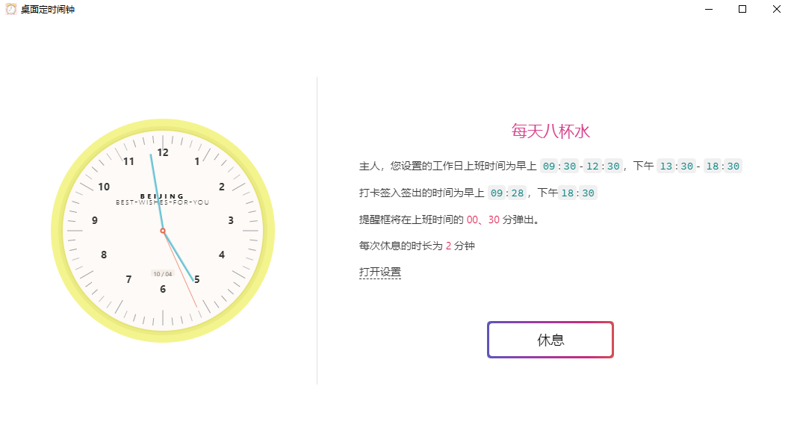

#  桌面定时闹钟

通过这个应用程序, 你可以设定弹框定时提醒休息和打卡.



## 运行

在构建此应用之前, 你需要安装 [Node.js](https://nodejs.org).

```bash
$ git clone https://github.com/lanlan1128/desktop-alarm
$ cd desktop-alarm
$ npm install
$ npm start
```

如果你不想通过克隆的方式, 你可以 [下载源码](https://github.com/lanlan1128/desktop-alarm/archive/master.zip).

为了便于开发, 你可以打开 DevTools 以全屏的方式运行程序:

```bash
$ npm run dev
```

## 构建

```bash
$ npm run package
```
